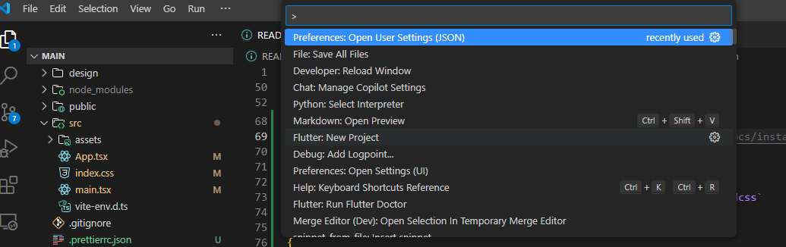
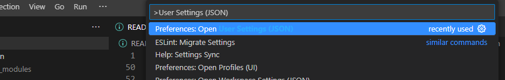

# Frontend Mentor - Loopstudios landing page

This is a solution to the [Loopstudios Landing Page](https://www.frontendmentor.io/challenges/loopstudios-landing-page-N88J5Onjw). Frontend Mentor challenges help you improve your coding skills by building realistic projects.

## Welcome! 👋

Thanks for checking out this front-end coding challenge.

[Frontend Mentor](https://www.frontendmentor.io) challenges help you improve your coding skills by building realistic projects.

**To do this challenge, you need a good understanding of HTML and CSS and a basic understanding of JavaScript.**

## Table of contents

- [Overview](#overview)
  - [The challenge](#the-challenge)
  - [Screenshot](#screenshot)
  - [Links](#links)
- [My process](#my-process)
  - [What I learn](#what-i-learn)
  - [Built with](#built-with)
  - [Useful resources](#useful-resources)
- [Author](#author)
- [Acknowledgments](#acknowledgments)

## Overview

### The challenge

Your challenge is to build out this landing page and get it looking as close to the design as possible.

This challenge focuses mostly on HTML & CSS. There's a tiny bit of JS included for the mobile navigation toggle. But you could also choose to do this without JS!

You can use any tools you like to help you complete the challenge. So if you've got something you'd like to practice, feel free to give it a go.

Your users should be able to:

- View the optimal layout for the site depending on their device's screen size
- See hover states for all interactive elements on the page

Want some support on the challenge? [Join our community](https://www.frontendmentor.io/community) and ask questions in the **#help** channel.

### Screenshots

### Links

- Solution URL: [GitHub repository](https://github.com/welpmoz/loopstudios-landing-page).
- Live Site URL: [Live site](https://silver-dango-3d4b5f.netlify.app/)

## My process

### What I've Learned

I've set up Tailwind CSS in my Vite project. Below are the steps I followed:

#### Installing Tailwind CSS

1. Install Tailwind CSS using pnpm:

   ```sh
   pnpm install tailwindcss @tailwindcss/vite
   ```

2. Configure Tailwind CSS in `vite.config.ts`:

   ```ts
   import { defineConfig } from "vite";
   import tailwindcss from "@tailwindcss/vite";

   export default defineConfig({
     plugins: [react(), tailwindcss()],
   });
   ```

For more details, check the [Tailwind CSS Installation Guide](https://tailwindcss.com/docs/installation/using-vite).

---

### Configuring Prettier for Tailwind CSS

To ensure Tailwind classes are formatted correctly, I configured Prettier as follows:

1. Install the Tailwind CSS Prettier plugin:

   ```sh
   pnpm install -D prettier-plugin-tailwindcss
   ```

2. Update the `.prettierrc.json` file:
   ```json
   {
     "plugins": ["prettier-plugin-tailwindcss"],
     "tailwindStylesheet": "./src/index.css"
   }
   ```

For more details, refer to the [Tailwind CSS Editor Setup Guide](https://tailwindcss.com/docs/editor-setup).

---

### Setting Up VS Code

To ensure this setup works properly, I configured VS Code with the following steps:

1. Open VS Code and press `Ctrl + Shift + P` (Windows) to open the command palette.
   

2. Search for `User Settings (JSON)` and select the first option.
   

3. Update `settings.json` with the following configurations:
   ```json
   {
     "editor.defaultFormatter": "esbenp.prettier-vscode",
     "editor.formatOnSave": true
   }
   ```

These settings ensure that Prettier automatically formats your code on save.

And that's it!

Finally, I decided not to use Tailwind CSS for the reasons mentioned here. However, I believe this configuration might be helpful for others.

### Built with

- Semantic HTML5 markup
- Accessibility
- Git & GitHub
- Mobile first approach
- CubeCSS
- Sass
- Vite
- React
- Typescript
- Netlify

### Useful resources

## Author

- Github - [Roswell Jaime](https://github.com/welpmoz)
- Frontend Mentor - [@welpmoz](https://www.frontendmentor.io/profile/welpmoz)

## Acknowledgments

I greatly appreciate the work done by the Frontend Mentor team. Their challenges are diverse and well-suited for developers at all levels. Additionally, I'm grateful for the inclusion of Figma as a useful resource.
